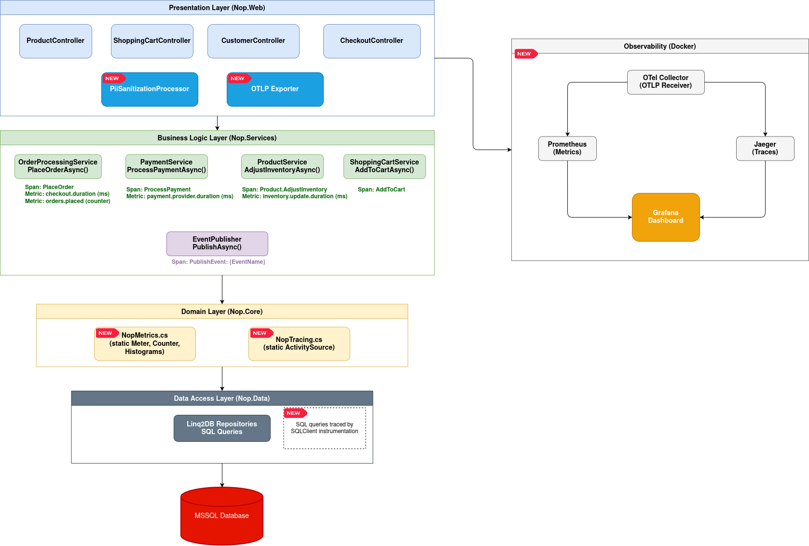
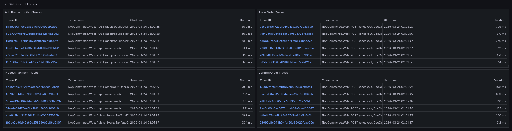

# Architecture

This is the final architecture diagram which represents the selected flow (Customer places an order):



# Trace Implementation

To achieve deep visibility into NopCommerce's distributed operations, end-to-end tracing was implemented using **OpenTelemetry (OTel)** SDK for .NET. The tracing architecture is broken into three distinct layers: automatic external instrumentation, centralized custom tracing, and event-based interception.

### 1. Infrastructure and Auto-Instrumentation

The foundation of our tracing requires capturing all entry points and fundamental dependencies:
* **OTLP Export:** The `OpenTelemetry.Exporter.OpenTelemetryProtocol` package was integrated into `Nop.Web`. This allows traces to be efficiently exported over gRPC directly to a **Jaeger** backend hosted in our Docker Compose stack.

* **HTTP & Entity Framework:** In `Program.cs`, the built-in ASP.NET Core instrumentation (`AddAspNetCoreInstrumentation`) was enabled to automatically capture all incoming web requests (e.g., POST `/checkout/OpcConfirmOrder`), and SQL Client instrumentation (`AddSqlClientInstrumentation`) to automatically trace the execution time of all underlying SQL queries generated by `Nop.Data`.

### 2. Centralized Custom Tracing (`NopTracing`)

To trace specific business logic, a centralized tracing utility was created:

* A static `NopTracing` class was introduced located within `Nop.Core.Infrastructure`.

* This class initializes a single, application-wide `ActivitySource` named `"NopCommerce.Web"`.

* By placing this in the `Nop.Core` layer, any controller, service, or plugin can statically reference `NopTracing.ActivitySource.StartActivity("OperationName")` to begin a custom trace span without needing Dependency Injection wiring.

### 3. `IEventPublisher` Tracing

As discussed earlier, almost all domain side-effects trigger an event via `IEventPublisher.PublishAsync`.

Instead of manually editing dozens of disparate consumer classes (like the Email Service or Inventory Service), the core `PublishAsync` method inside `Nop.Services.Events.EventPublisher` was instrumented with an OpenTelemetry trace span.

# Metrics Implemented

Four custom OpenTelemetry instruments in `NopMetrics.cs` were created to explicitly monitor the business performance of the checkout flow:

1.  **`orders.placed`** (Counter)
    *   Tracks the total volume of successful and failed orders.
2.  **`checkout.duration`** (Histogram)
    *   Measures the end-to-end latency of the entire `PlaceOrderAsync` operation.
3.  **`inventory.update.duration`** (Histogram)
    *   Tracks the performance of database inventory adjustments (`ProductService.AdjustInventoryAsync`).
4.  **`payment.provider.duration`** (Histogram)
    *   Measures the latency introduced specifically by external third-party payment gateways (`PaymentService.ProcessPaymentAsync`). For this case, since the payments are mocked, this metric is not entirely meaningful, but it was kept since it would be relevant in production.


# Dashboard

Metrics:


Traces:



# Load Test

To stress-test the observability instrumentation and ensure the dashboard correctly tracked throughput, latency, and errors under pressure, a comprehensive load testing script was created using **k6** (`load-test/checkout-flow.js`).

### 1. Traffic Strategy
The script simulates a realistic, 4-minute "ramp-up / ramp-down" traffic pattern using k6 stages. It progressively scales from 0 up to 10 concurrent Virtual Users (VUs) and then scales back down, ensuring we capture both "cold start" latency and sustained throughput capacity.

### 2. Simulated User Journey
* **Product Discovery:** Visits the homepage and randomly navigates to a predefined laptop product page.
* **Security Handling:** Parses the HTML response body using RegExp to extract the ASP.NET Core `__RequestVerificationToken` (anti-CSRF token).
* **Cart Management:** Submits a POST request to add the random product to the shopping cart.
* **Checkout Flow:** Progresses through the "Checkout as Guest" steps, submitting Billing Address, saving dummy Shipping options, selecting the `Payments.CheckMoneyOrder` gateway, and saving Payment Information.
* **Order Confirmation:** Submits the final `POST /checkout/OpcConfirmOrder` request to seal the transaction.

### 3. Intentional Fault Injection
The most critical part of this load test was proving that the custom OpenTelemetry Error Metrics (`order.status = failure`) actually worked. 

To achieve this organically, a 20% random fault mechanism was introduced at the very end of the script (`Math.random() < 0.2`). When triggered, the script intentionally submits the final `OpcConfirmOrder` POST request a *second time*. Because the user's cart was already successfully emptied by the first request, this malicious double-submit reliably triggers an "empty cart" exception inside the NopCommerce `CheckoutController`.


# How to run

Run the application with the following command:

```bash
docker compose up --build
```

Once the containers are running, you can access the following interfaces in your browser:
* **The e-Commerce Store:** [http://localhost](http://localhost)
* **Grafana (Dashboards):** [http://localhost:3000](http://localhost:3000)
* **Jaeger (Distributed Tracing):** [http://localhost:16686](http://localhost:16686)
* **Prometheus (Raw Metrics):** [http://localhost:9090](http://localhost:9090)


If it is desired to run the load test to popul

```bash
k6 run load-test/checkout-flow.js
```


# LLM Acknowledgements

LLM models were used to assist in the development of this project. Firstly, it helped me to understand the large codebase of this project, before starting the implementation of the requirements of the project. It also served as a tool to discuss and validate the best approaches to implement the instrumentation required, based on the guidelines provided. Finally, it was used to write and format the final documentation, such as this README.md file and the CRITIQUE.md.


