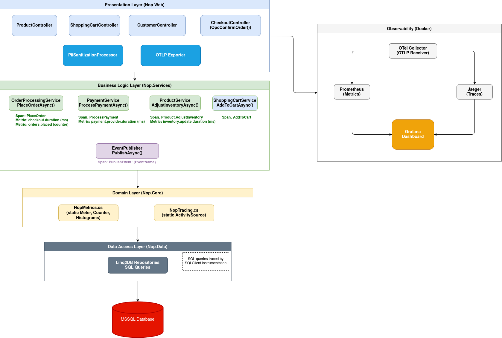
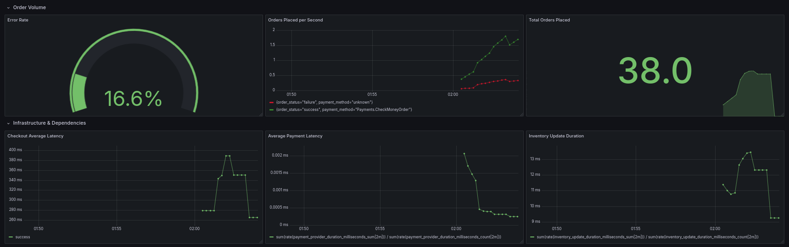

# Layers Organization and Dependency Rules

NopCommerce follows a **N-Tier Layered Architecture**. The foundational dependency rule of this architecture is that **dependencies strictly flow downwards** toward the core. Upper layers depend on lower layers, but lower layers maintain zero knowledge of the layers above them.

The system is organized into the following primary layers, from top to bottom:

### 1. Presentation Layer (`Nop.Web`)
* **Responsibility:** Handles UI rendering, HTTP request routing, MVC controllers, and API endpoints. It acts as the interactive entry point for users interacting with the store (e.g., `CheckoutController`).
* **Dependency Rule:** Sits at the top and depends on all lower layers (primarily `Nop.Services` and `Nop.Core`).

### 2. Business Logic Layer (`Nop.Services`)
* **Responsibility:** Where core business rules, calculations (like taxes and discounts), and workflows are executed. It orchestrates actions between the database and the domain entities.
* **Dependency Rule:** Depends heavily on `Nop.Core` (for domain models) and `Nop.Data` (for database access/repositories). It is completely decoupled from the Presentation Layer.

### 3. Data Access Layer (`Nop.Data`)
* **Responsibility:** Acts as the translation layer between C# code and the SQL database using **LinqToDB**. It defines the mapping configurations (using `NopMappingSchema`) to convert domain entities into database tables and provides the Repository implementation via `IRepository<T>`.
* **Dependency Rule:** Depends entirely on `Nop.Core` to know which entities it needs to persist.

### 4. Domain Layer (`Nop.Core`)
* **Responsibility:** The foundational layer of the system. It contains the core domain entities (e.g., `Customer`, `Order`, `Product`), common helper classes, and crucial abstract interfaces (like `IEngine` for Dependency Injection and `IEventPublisher` for internal messaging).
* **Dependency Rule:** This layer sits at the very bottom and **depends on no other layers** within the NopCommerce solution.


# Internal Event Handling and `IEventPublisher`

NopCommerce handles events internally using an **In-Process Publisher/Subscriber** pattern. It does not use heavy external message brokers like RabbitMQ or Kafka. Instead, the events are dispatched and consumed synchronously within the application memory space itself.

### The Role of `IEventPublisher`

The `IEventPublisher` interface, defined in the `Nop.Core` layer, is the primary mechanism used for this event system. Its core architectural purpose is to enforce **extreme decoupling** (Separation of Concerns).

Without an event publisher, a core service (like `OrderProcessingService`) would need to directly dependency-inject every other service dealing with the side-effects of an order (e.g., sending confirmation emails, updating product inventory, adjusting reward points). This would create a monolithic, tightly-coupled nightmare. By utilizing `IEventPublisher`, the order service simply broadcasts that an event occurred (e.g., `EntityInsertedEvent<Order>`) and finishes its job. Specialized "consumer" classes secretly listen for this broadcast and independently execute their own specific tasks.

### Architectural Impact on Observability

From an instrumentation perspective, this pattern is a massive advantage. Because almost all critical domain side-effects are funneled through the single `IEventPublisher.PublishAsync` method, it creates a perfect, centralized interception boundary for OpenTelemetry. By wrapping just this one method in an `ActivitySource.StartActivity` span, we can automatically trace hundreds of domain operations across the entire application without needing to edit hundreds of individual source files.


# Where the Code Makes Observability Easy — and Hard

### Easy Instrumentation

NopCommerce's strict use of Dependency Injection and well-defined service interfaces makes several aspects of instrumentation straightforward:

* **Centralized metric definitions:** Because `Nop.Core` sits at the bottom of the dependency graph and is referenced by every other layer, we can define all custom OpenTelemetry instruments (Histograms, Counters) in a single static class (`NopMetrics`) and record data from any layer — Services, Presentation, or Plugins — without circular dependencies.

* **Clear service boundaries:** High-level methods like `OrderProcessingService.PlaceOrderAsync` and `ProductService.AdjustInventoryAsync` are well-isolated entry points. Wrapping them with a `Stopwatch` and a `Histogram.Record()` call immediately yields meaningful end-to-end latency data.

* **The `IEventPublisher` interception point:** As described above, wrapping the single `PublishAsync` method with an OpenTelemetry Activity span provides automatic distributed tracing across hundreds of domain events with a single code change.

### Hard Instrumentation

Two areas of the codebase make adding observability significantly more difficult:

* **ASP.NET Core conventional routing:** NopCommerce uses conventional MVC routing (e.g., `{controller}/{action}/{id?}`), which causes the built-in OpenTelemetry HTTP instrumentation to group almost all POST requests into a single, generic metric bucket. This makes it impossible to isolate the performance of specific endpoints (like `OpcConfirmOrder`) using standard HTTP metrics alone — forcing us to create custom, business-level metrics instead.


* **The "God Service" problem:** `OrderProcessingService.cs` is a 2,000+ line class where dozens of distinct operations all execute inside a single `PlaceOrderAsync` method. Because there is no natural boundary between these sub-operations, it is impossible to trace them individually without manually injecting `ActivitySource.StartActivity` spans deep inside the method body.


# Architecture

This is the final architecture diagram which represents the selected flow (Customer places an order):



# Trace Implementation

To achieve deep visibility into NopCommerce's distributed operations, end-to-end tracing was implemented using **OpenTelemetry (OTel)** SDK for .NET. The tracing architecture is broken into three distinct layers: automatic external instrumentation, centralized custom tracing, and event-based interception.

### 1. Infrastructure and Auto-Instrumentation

The foundation of our tracing requires capturing all entry points and fundamental dependencies:
* **OTLP Export:** The `OpenTelemetry.Exporter.OpenTelemetryProtocol` package was integrated into `Nop.Web`. This allows traces to be efficiently exported over gRPC directly to a **Jaeger** backend hosted in our Docker Compose stack.

* **HTTP & Entity Framework:** In `Program.cs`, the built-in ASP.NET Core instrumentation (`AddAspNetCoreInstrumentation`) was enabled to automatically capture all incoming web requests (e.g., POST `/checkout/OpcConfirmOrder`), and SQL Client instrumentation (`AddSqlClientInstrumentation`) to automatically trace the execution time of all underlying SQL queries generated by `Nop.Data`.

### 2. Centralized Custom Tracing (`NopTracing`)

To trace specific business logic, a centralized tracing utility was created:

* A static `NopTracing` class was introduced located within `Nop.Core.Infrastructure`.

* This class initializes a single, application-wide `ActivitySource` named `"NopCommerce.Web"`.

* By placing this in the `Nop.Core` layer, any controller, service, or plugin can statically reference `NopTracing.ActivitySource.StartActivity("OperationName")` to begin a custom trace span without needing Dependency Injection wiring.

### 3. `IEventPublisher` Tracing

As discussed earlier, almost all domain side-effects trigger an event via `IEventPublisher.PublishAsync`.

Instead of manually editing dozens of disparate consumer classes (like the Email Service or Inventory Service), the core `PublishAsync` method inside `Nop.Services.Events.EventPublisher` was instrumented with an OpenTelemetry trace span.

# Metrics Implemented

Four custom OpenTelemetry instruments in `NopMetrics.cs` were created to explicitly monitor the business performance of the checkout flow:

1.  **`orders.placed`** (Counter)
    *   Tracks the total volume of successful and failed orders.
2.  **`checkout.duration`** (Histogram)
    *   Measures the end-to-end latency of the entire `PlaceOrderAsync` operation.
3.  **`inventory.update.duration`** (Histogram)
    *   Tracks the performance of database inventory adjustments (`ProductService.AdjustInventoryAsync`).
4.  **`payment.provider.duration`** (Histogram)
    *   Measures the latency introduced specifically by external third-party payment gateways (`PaymentService.ProcessPaymentAsync`). For this case, since the payments are mocked, this metric is not entirely meaningful, but it was kept since it would be relevant in production.


# Dashboard

Metrics:



Traces:


# Load Test

To stress-test the observability instrumentation and ensure the dashboard correctly tracked throughput, latency, and errors under pressure, a comprehensive load testing script was created using **k6** (`load-test/checkout-flow.js`).

### 1. Traffic Strategy
The script simulates a realistic, 4-minute "ramp-up / ramp-down" traffic pattern using k6 stages. It progressively scales from 0 up to 10 concurrent Virtual Users (VUs) and then scales back down, ensuring we capture both "cold start" latency and sustained throughput capacity.

### 2. Simulated User Journey
* **Product Discovery:** Visits the homepage and randomly navigates to a predefined laptop product page.
* **Security Handling:** Parses the HTML response body using RegExp to extract the ASP.NET Core `__RequestVerificationToken` (anti-CSRF token).
* **Cart Management:** Submits a POST request to add the random product to the shopping cart.
* **Checkout Flow:** Progresses through the "Checkout as Guest" steps, submitting Billing Address, saving dummy Shipping options, selecting the `Payments.CheckMoneyOrder` gateway, and saving Payment Information.
* **Order Confirmation:** Submits the final `POST /checkout/OpcConfirmOrder` request to seal the transaction.

### 3. Intentional Fault Injection
The most critical part of this load test was proving that the custom OpenTelemetry Error Metrics (`order.status = failure`) actually worked. 

To achieve this organically, a 20% random fault mechanism was introduced at the very end of the script (`Math.random() < 0.2`). When triggered, the script intentionally submits the final `OpcConfirmOrder` POST request a *second time*. Because the user's cart was already successfully emptied by the first request, this malicious double-submit reliably triggers an "empty cart" exception inside the NopCommerce `CheckoutController`.


# How to run

Run the application with the following command:

```bash
docker compose up --build
```

Once the containers are running, you can access the following interfaces in your browser:
* **The e-Commerce Store:** [http://localhost](http://localhost)
* **Grafana (Dashboards):** [http://localhost:3000](http://localhost:3000)
* **Jaeger (Distributed Tracing):** [http://localhost:16686](http://localhost:16686)
* **Prometheus (Raw Metrics):** [http://localhost:9090](http://localhost:9090)


If it is desired to run the load test to popul

```bash
k6 run load-test/checkout-flow.js
```


# LLM Acknowledgements

LLM models were used to assist in the development of this project. Firstly, it helped me to understand the large codebase of this project, before starting the implementation of the requirements of the project. It also served as a tool to discuss and validate the best approaches to implement the instrumentation required, based on the guidelines provided. Finally, it was used to write and format the final documentation, such as this README.md file and the CRITIQUE.md.


